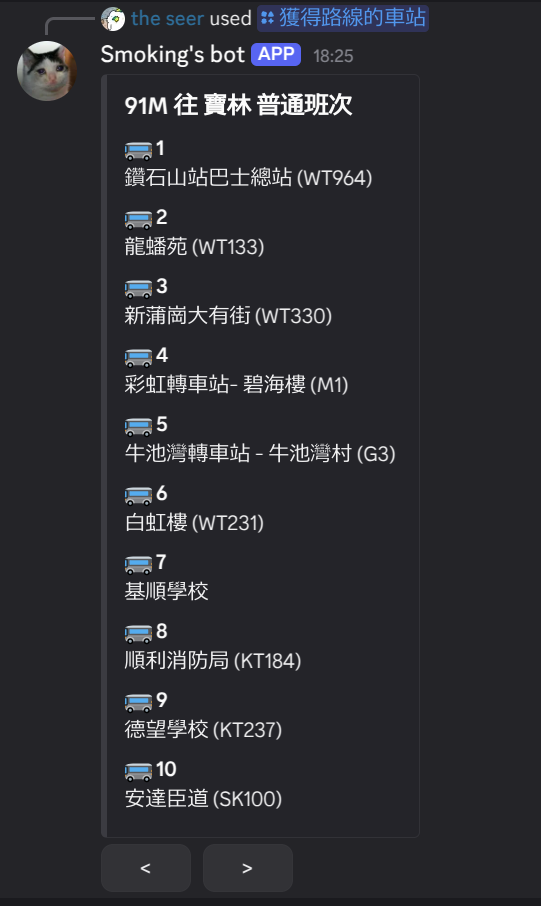
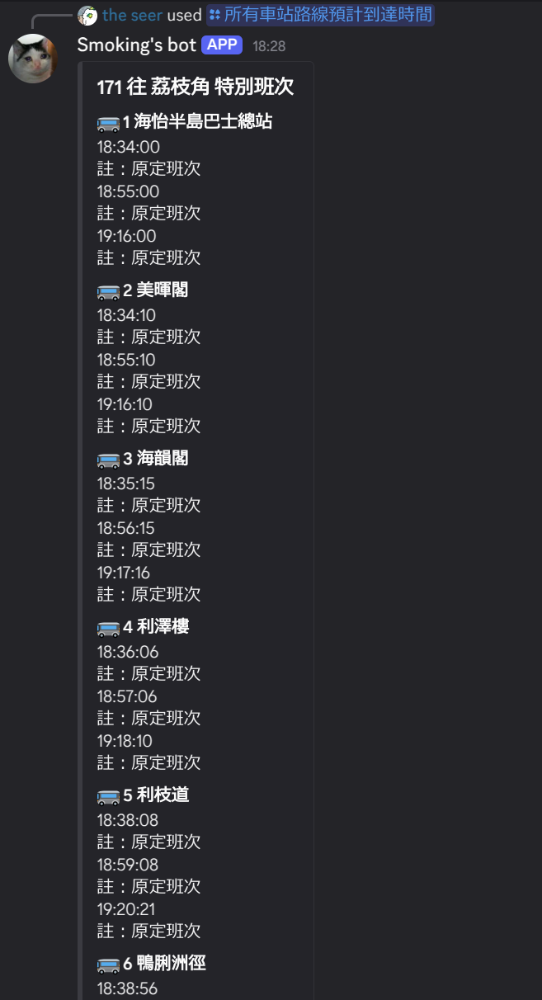

Feature:

|      Get the stations of a bus route      | Get the estimated time of arrival of the next bus |
|------------|-------|
|        |       |


  
   

To run the bot (Assuming you are running on *NIX system (macOS / Linux / ...):

1. Clone this repo
```bash
git clone https://github.com/SmokingPuddle58/smokingpuddle-bot
```

2. Create and activate the virtual environment
```bash
cd smokingpuddle-bot
python -m venv ./.venv
source .venv/bin/activate 
```

3. Install the dependencies
```bash
pip install discord
```

4. Fill in the details

    Create a file `.env`, fill in the following data
    ```
    DISCORD_TOKEN=<BOT-TOKEN>
    SERVER_ID=<SERVER-ID>
    ```
    Where <BOT-TOKEN> can be obtained in Discord Developer Portal, and <SERVER-ID> is the ID of the server you want to install, can be obtained in discord app.
5. Initialization of database
```bash
python init_db.py
```
6. Run the bot!
```bash
python discord_main.py
```
